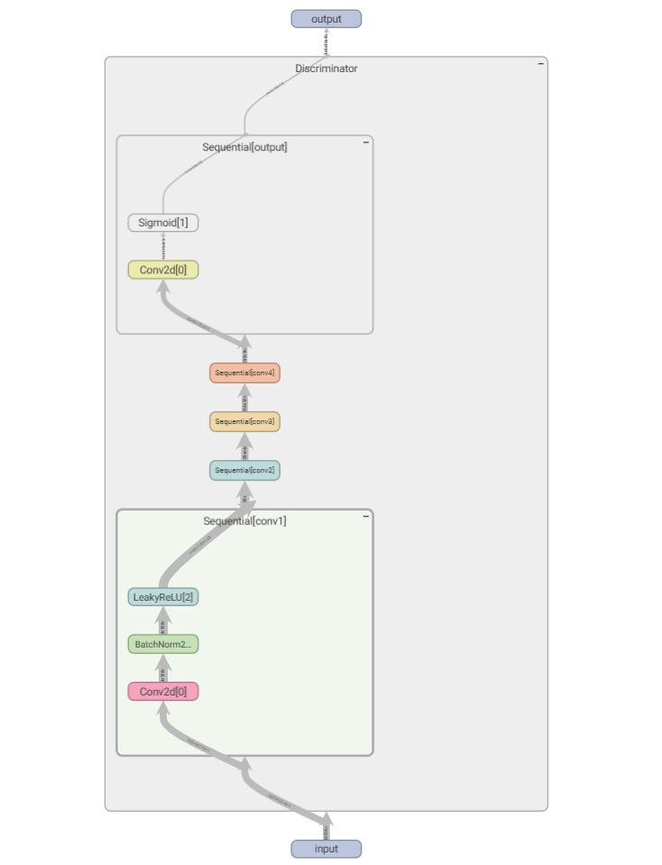
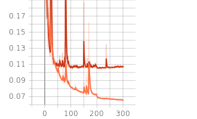
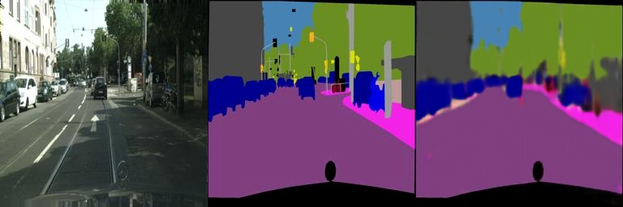
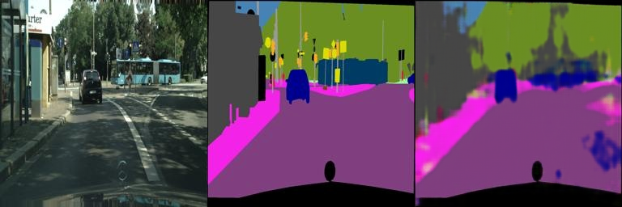
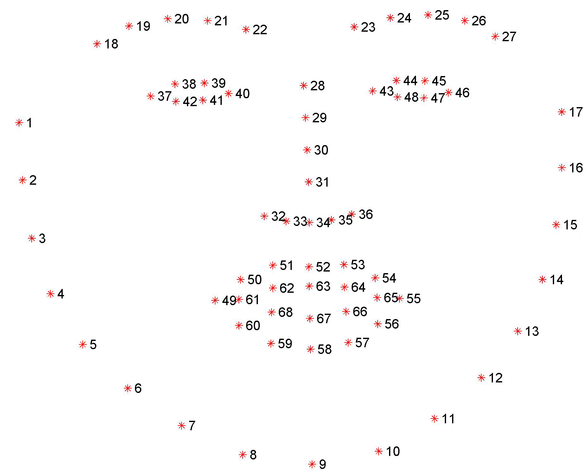

# Assignment 3 - Play with GANs

### In this assignment, you will implement two methods for using GANs in digital image processing.

### Resources:

- [DragGAN](https://vcai.mpi-inf.mpg.de/projects/DragGAN/): [Implementaion 1](https://github.com/XingangPan/DragGAN) & [Implementaion 2](https://github.com/OpenGVLab/DragGAN)
- [Facial Landmarks Detection](https://github.com/1adrianb/face-alignment)

---

### Pix2Pix 添加GANNetwork

上一次作业中我们是直接使用卷积网络实现了一个图片->语义图的模块，其实可以理解为是一个生成器，但是上一节中直接使用l1损失监督训练网络收敛效果有限，因此这里尝试加入GAN trick，思路就是将上一节实现的网络视为一个Generator，而我们再本节中再额外定义一个鉴别器Discriminator，Discriminator也是一个自学习的用于鉴别tuple<rgb,semantic>是直接GT拼接的还是Generator生成的，这样我们在Generator的监督就不再仅有recon部分的l1损失，而是还额外加入了一个gan loss去鼓励Generator提升欺骗Discriminator的能力也就是进一步在l1 recon重建的基础上进一步加入了感知损失进一步提升Generator的图片->语义图的映射生成能力，这里的Discriminator同样需要训练通过real_loss与fake_loss实现。由于Generator结构与上一节相同因此这类仅给出Discriminator的结构图：

以下是训练期间Generator的loss曲线：

以及部分Generator验证集结果图：

> 在300轮训练中选取了验证集上表现最佳的模型epoch220，以下结果图均生成自220轮结果(result7,result10)

Input RGB,GT Semantic,Infer Semantic

注意这里的损失比例对实验结果影响较大，加入GAN loss虽然可以提升模型收敛后的性能，但是为了保证Generator是在尽可能与GT Semantic重建接近的情况提升对语义的感知性能，因此这里的Generator的总损失项的两部分l1与gan(rec与adv)权重比为20：1

### DragGAN结合FaceAlignment实现自动化操作人脸表情修改

这里首先需要结合Resources安装对应模块，这里我选择了Implementation2，其中需要注意安装完成后项目存在bug无法正常操作需要进一步安装 `pip install pydantic==1.10.11 `并且模型下载需要较慢这里选择手动下载stylegan2-ffhq-config-f.pkl放置DragGAN/draggan/checkpoints/stylegan2文件夹下并在没有代理下启动gradio即可

其中黄色关键点是使用FaceAlignment提取的人脸关键点，接下来我们添加一个Close Eye按钮自动实现闭眼功能，结合下面给出的人脸参考图：

实现闭眼功能，只需要将38，39接近42和42，44，45接近48和47号关键点即可，这里注意具体的索引从0开始，之后我们参考Drag实现定义close_eye_points的handle属性以及target属性即可，以下是实现演示：

See [作业03-Play_with_GANs.pptx](https://rec.ustc.edu.cn/share/705bfa50-6e53-11ef-b955-bb76c0fede49) for detailed requirements.
